# Cryptocurrencies

### **Objectives**

The objective of this project is to create a report on crypto currencies for Martha, who is a senior manager for the investemnet bank, Accountability Accounting. The company is interested in offering a new cryptocurrency investment portfolio for its customers. The company needs information about the cryptocurrencies that are currently traded in the market and to make a grouped classification system. Martha has a dataset of cryptocurrencies that could be analysed in a variety of ways. We used unsupervised machine learning on a dataset of crypto currencies. An unsupervised machine learning algorithm searches for trends based on the data it receives to perform feature extraction and feature selection.

### **Ananlysis**

#### **Loading and Cleaning the data**

We are given a dataset with 1,253 rows in a file *crypto_data.csv*. The data contained information about _CoinName_, _Algorithm_, _IsTrading_, _ProofType_, _TotalCoinsMined_ and _TotalCoinSupply_. Out of all the coins in the list, 1,137 coins are trading (Fig 1). We obtained this result after filtering out the coins that are not trading. Many of the remaining rows had null values that was removed. This brought down the data to 685 rows. We searched for the coins that are mined by filtering the _TotalCoinsMined_ values greater than zero. I noticed that there was an extra row of data when I used the filter criteria "== 0". I found that one row has a negative value for _TotalCoinsMined_ mined (Fig 2). The number of rows reduced to 532 rows and five columns. We removed the column labeled  _IsTrading_ for fitting the data using machine learning. This column will always be true because of our filtering. Fig 3 shows the mined cryptocurrencies dataframe.

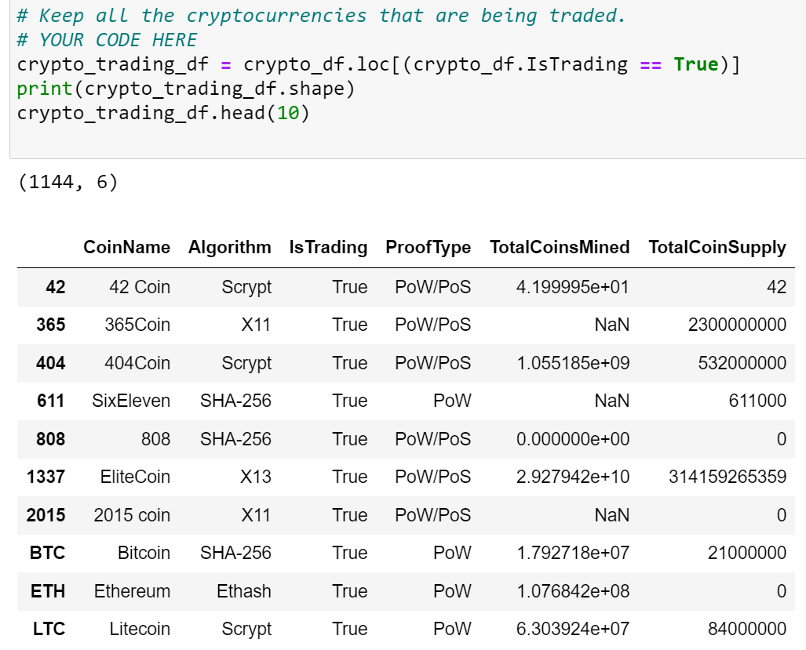

**Fig 1:** The dataframe image showing crypto currencies that are traded. There are 1,137 rows of information. Note that there are several NaN in this data.

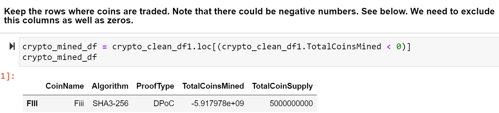

**Fig 2:** The image shows a negative entry for number of coins mined. I filtered this row out.

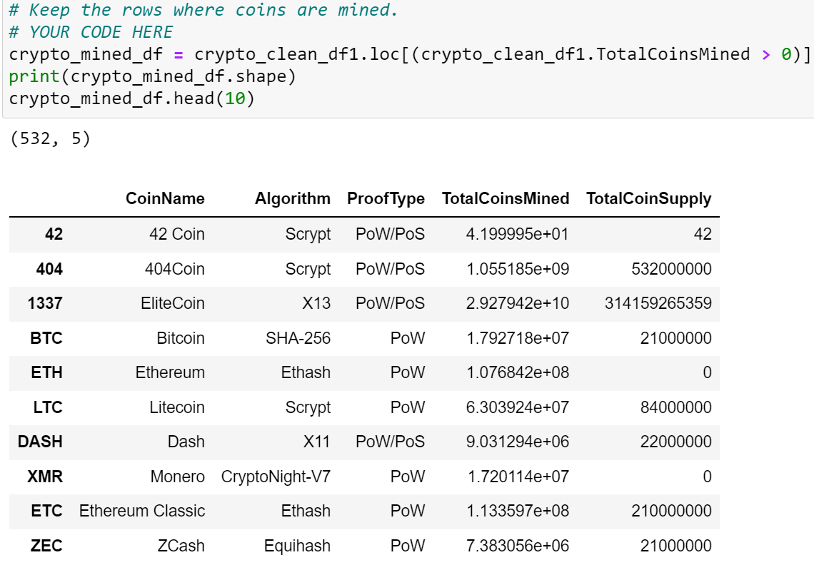

**Fig 3:** The dataframe is showing the columns and number of rows of useful data. Note that the columns _IsTrading_ is removed from this dataframe.

We filetered out the _CoinName_ column data out of the dataframe since the name of the coins do not give any useful fitting data. Next, a dataframe with just the _CoinName_ column was made. Fig 4 shows the dataframe after dropping the CoinName colum. There are now four columns of data. We used *get_dummies* method split "Algorithm" and "ProofType" into multiple columns of numerical values of 0 and 1. This increased the total number of columns to 98 for the machine learning algorithm to fit.

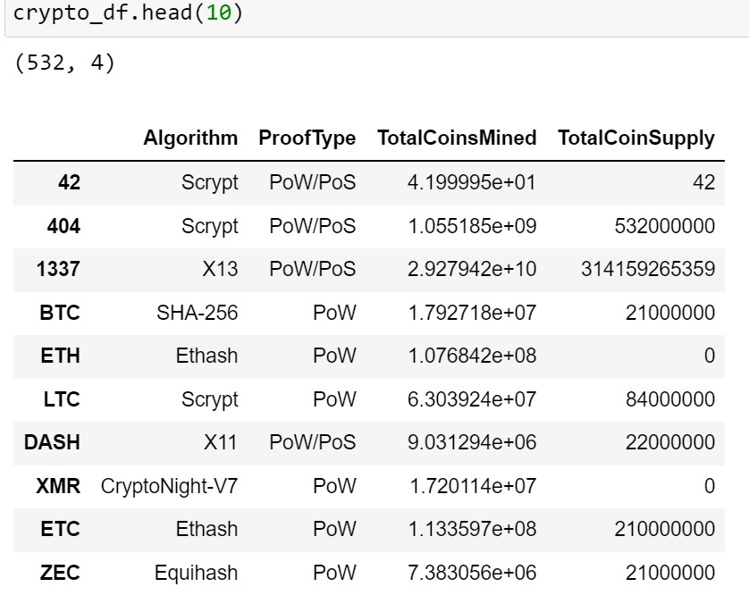

**Fig 4:** The figure shows the dataframe after the CoinName and IsTrading columns are dropped from the original data.

#### **Using unsupervised machine learning**

- **Reduce Dimensions:** We used dimension reduction using Principal Component Analysis (PCA) that took 98 attributes down to 3 Principal Components. PCA is a statistical technique to speed up machine learning algorithms when the number of input features (or dimensions) is very large. We had 98 dimensions in our data. PCA can reduce the number of dimensions by transforming the set of vaiables into a smaller one that contains most of the information in the original large set in terms of explaining variance. We used the following steps to run the unsupervised machine learning (UML) following the instructions given by Module Challenge. (i) We used StandardScaler to standardize the features. (ii) We reduced the number of dimensions to three and named them **PC 1**, **PC 2**, and **PC 3**. (iii) We created a dataframe with the three PCA dimensions and used the index of the *crypto_df* dataframe (Fig 5).

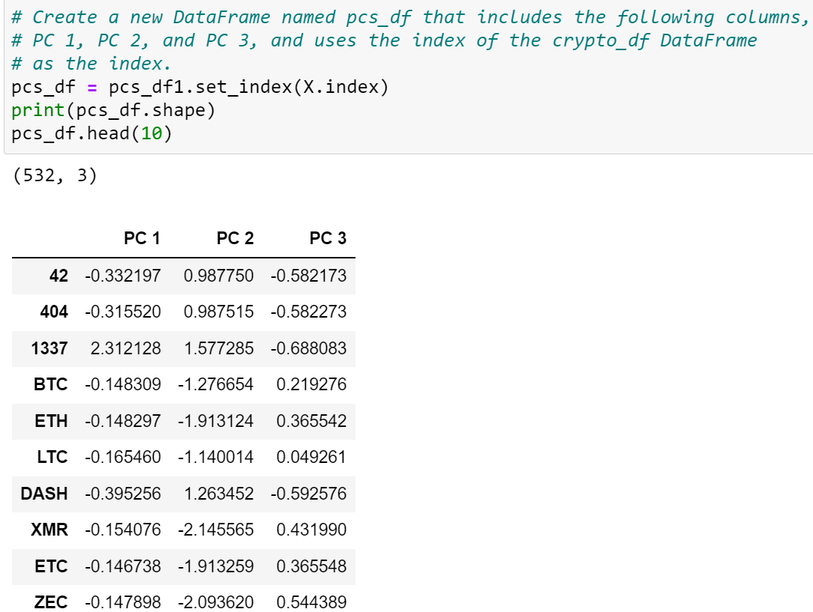

**Fig 5:** The dataframe showing the three principal components with the index from the *crypto_df*. 

- **Elbow curve and clustering using K-Means** : I created an elbow curve with a list of inertia (y-axis) and k-mean (x-axis) values. The **K** value shows how many clusters there will be. A cluster is determined by looking at similar features. Notice that PCA reduced the raw dimensions into three features. The K-means is an unsupervised learning algorithm that identifies the number of clusters from these three PCA features. The model is fit so that K-means makes a cluster based on some similarity or distance measure to a centroid. The **inertia** is an objective function that is measuring the amount of variation in a dataset. The elbow curve is shown in Fig 6. There is a clear shift from the vertical steep slope to a shallow horizontal slope at k = 4. We will use k=4 for our number of clusters to plot. 

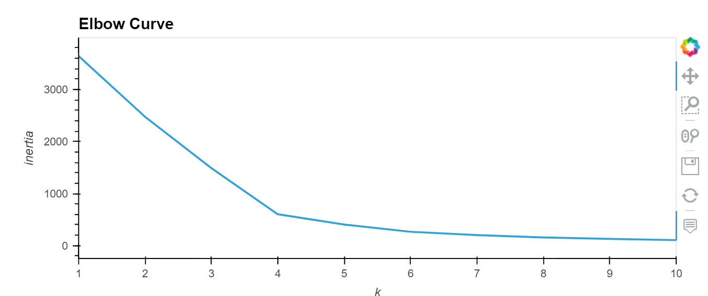

**Fig 6:** The _Elbow curve_ showing that the best value of k is 4. 

The K-means made predictions and separated the PCA features into four columns and made a prediction. I combined the original the dataframes *crypto_df* with *pcs_df*, *CoinName_df* and the *Class* values predicted by the K-means value. See the image in Fig 7. Note that the "Class" here represents a cluster number.

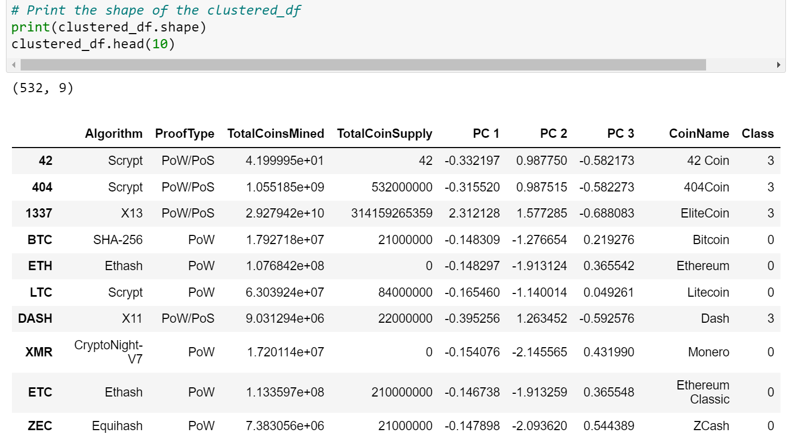

**Fig 7:** The dataframe in the figure has features from the machine learning combined with the original dataframe. It is ready for visualziation. 

#### **Visualization of the Data**

I checked the data in a 2D scatter hvplot by plotting each pair, PC1/PC2, PC1/PC3 and PC2/PC3. Fig 8 shows one such plot of PC2 vs PC1 that is sorted by Class. This plot shows that one point from Class=2 is an outlier. A 3D scatter plot shows a better visualization of the clusters as shown in Fig 9. The figure is plotted usling Plotly Express. The figure shows that one item from Class 2, BitTorrent is an outlier. There is some overlap between points belonging to Classes 0 and 3. There are also some outliers in Class 3. Fig 9a, 9b and 9c shows different views of the same 3D plot. We created a table using _hvplot.table()_ that shows the coins that are currently trading in Fig 10. Note that these datapoints are showing "IsTrading"=True data. There are a total of 1,137 cryptocurrencies trading. Out of those, 531 cryptocurrencies have nonezero values (Fig 11 and 12). 

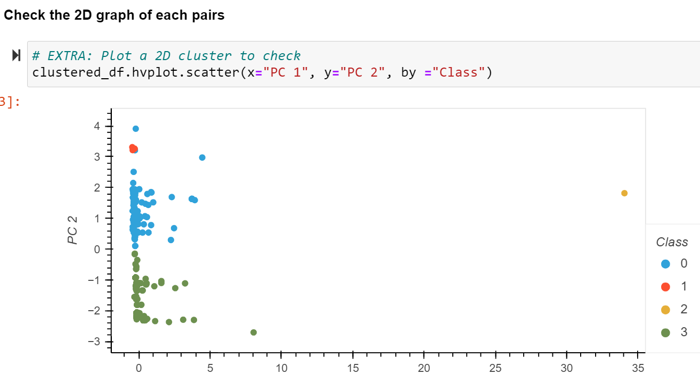

**Fig 8:** The image shows a 2D plot of PC 2 vs PC 1. The figure shows an outlier, from Class 2. Only one item belongs to this class. 

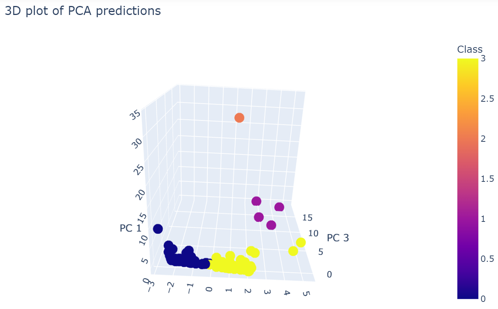
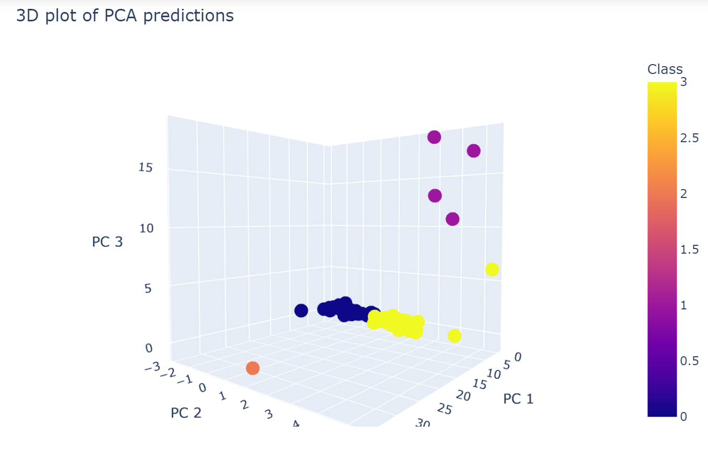
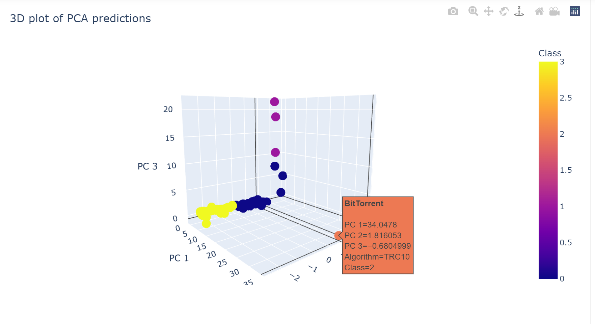

**Fig 9 a, b and c:** The figure shows a 3D plot of the PCA components grouped by cluster Classes. The coin, BitTorrent is an outlier. The hover_name gives the CoinName, class and the PCA values.

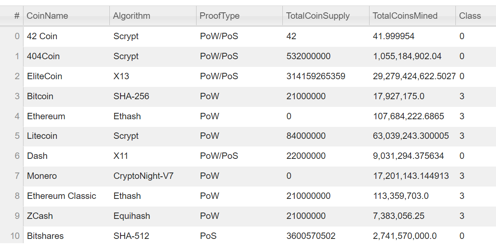

**Fig 10:** The figure shows a table created from the _hvplot.table()_. It shows the cryptocurrencies that are currently trading. 

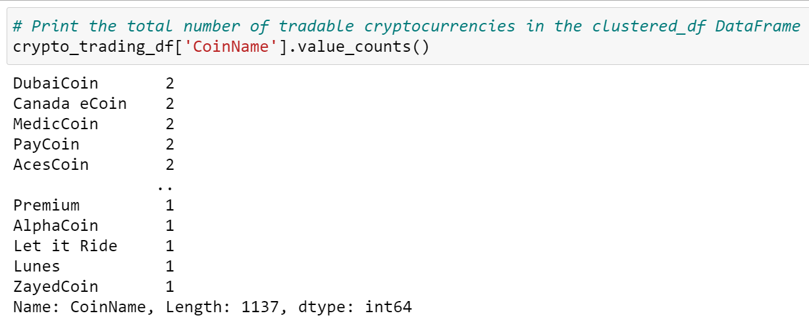

**Fig 11:** The figure shows total number of tradable coins. This value includes the coins that have null values. 

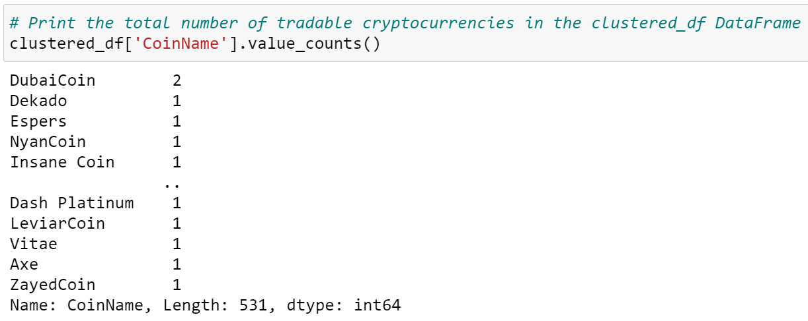

**Fig 12:** The figure shows the number of coins that are currently trading and it has no null values. 

#### **Using MinMaxScaler to standardize the data**

- **Using MinMaxScaler().fit_transform on the data:** The MinMaxScaler is used to scale the data between a range of [0,1] for positive values. 
We used the sclaing on "TotalCountSupply" and "TotalCoinsMined". I changed the data type of TotalCoinSupply from _object_ to _floating_ before using the MinMaxScaler(). I created a dataframe after scaling. Finally, I created a dataframe with the index of the *clustered_df*, the scaled TotalCoinSupply and TotalCoinsMined data, the CoinName and the Class information (Fig 13). Finally I made a 2D hvplot scatter plot of *TotalCoinSupply* and *TotalCoinsMined* with "CoinName" as the hover_cols (Fig 14). The hover_name gives the CoinName and the class.

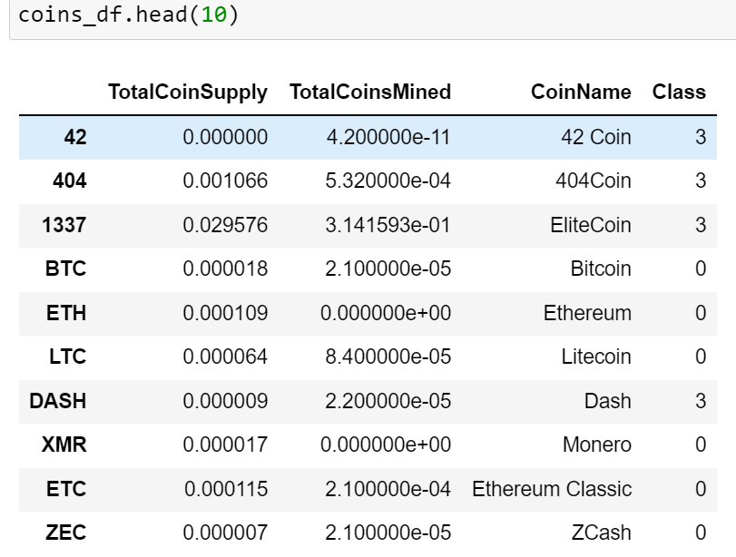

**Fig 13:** The dataframe shows the *MinMaxScaled.fit_transformed* data, CoinName and Class information. 

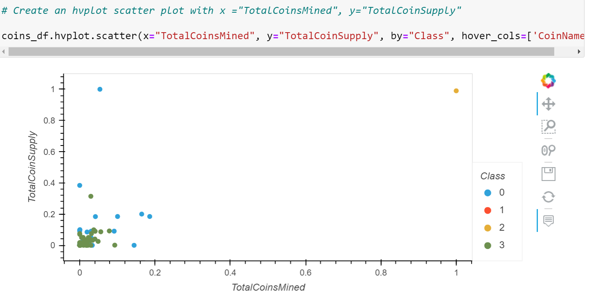

**Fig 14:** A 2D hvplot scatter plot of TotalCoinSupply and TotalCoinsMined. The plot suggests two outliers in the data.

### **Summary and Conlusion**

The goal of the Cryptocurrency Project is to use unsupervised machine learning algorithm to find trends of the cryptocurrencies in the dataset provided to us. We used three principal components on our scaled data. I used *explained_variance_ratio* to learn how much information can be attributed to the principal component. Our analysis only contaned about 7% of the information was in the principal components (Fig 15). Too much information is missed in this analysis.  We used three principal components for analysis following the module challenge instructions. We should increase the number of principal components and see if it would improve the explained variance ratio. Perhaps other machine learning methods are necessary. It is clear however, that the relevant dimensions of features is much more than 3 principal components. The number of four clusters from K-mean was clear from the elbow curve. Note that everytime I ran the jupyter notebook, I found that the PCA values were slightly different. I could not account for this variation. In general, discussion groups point out that PCA is not considered a good approach when the input data is binary, as is the case here for the vast majority of variables (0 or 1). Other machine learning methods should be considered.  

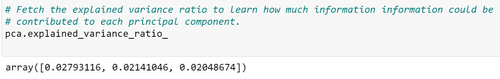

**Fig 15:** The image shows the *explained_ariance_ratio* of the three PCA analaysis. Note that the three componenets accounts for a total of about 7% of the data.

After cleaning and scaling the data we found that the BitTorrent has a different trading nature. It could be because it is highly traded and there are more supplies of BitTorrent. After scaling the data with MinMaxScaler and plotting the data using 2d hvplot (Fig 14) we found that another coin, TurtleCoin is an outlier. It appears that TurtleCoin has more supplies, but is not mined as much. Not knowing much about cryptocurrencies I cannot make an informed observation, other than BitTorrent stands out from other cryptocurrencies in both supplies and mined numbers. An investor has to pay attention to the pros and cons of coins supplied and coind mined. 